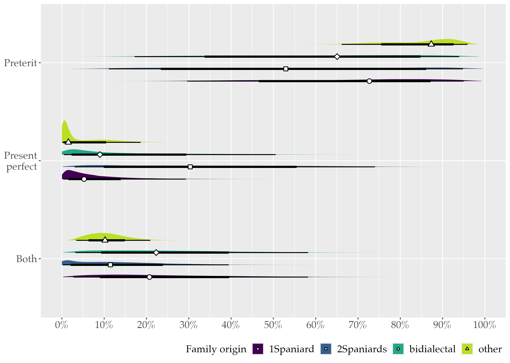
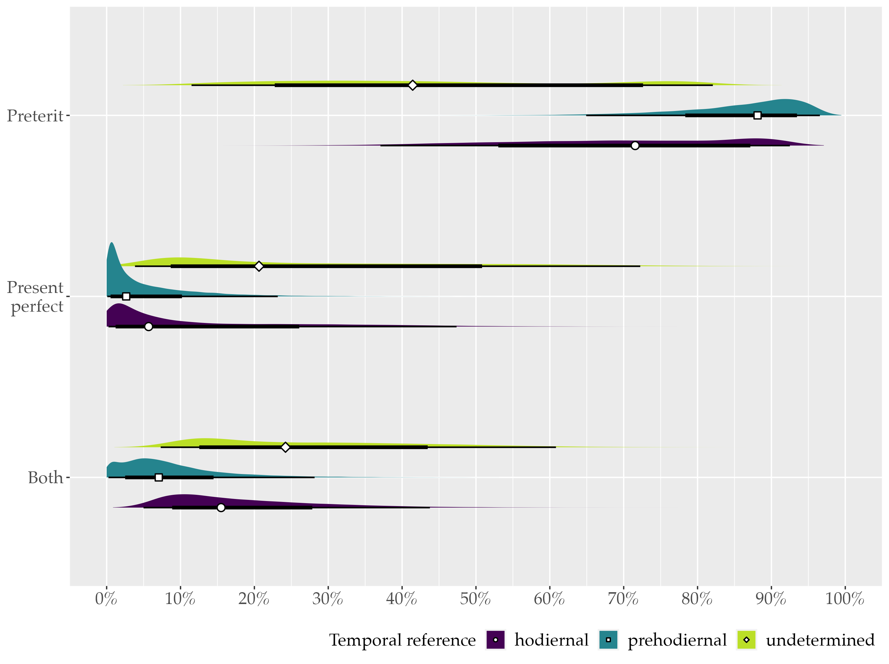

```{r setup, include=FALSE, echo=FALSE}
library(here)
```


# Studying Variation and Perfectivity

+ .black[Variationist sociolinguistics] &rarr; Study .black[structured variation] to advance our understanding of the variability of linguistic patterns (Labov, 1999; Nagy & Gadanidis, 2021; Shin, 2022)

+ However... strong focus on .black[monolinguals] and .black[L2 learners] (Gudmestad & Geeslin, 2013; Nagy & Gadanidis, 2021)

+ Since the early 2000s &rarr; Increasing interest in the use of the .black[Spanish perfective past time paradigms] by .black[monolinguals] (Fuchs & González, 2022; Howe & Schwenter, 2003, 2008; Jara, 2017; Peña Arce, 2023; Rodríguez Louro, 2010; Schwenter & Torres Cacoullos, 2008):
  + the .black[preterit, PRET] (*bailé*, 'I danced')

  + the .black[present perfect, PPERF] (*he bailado*, 'I have danced')

---
<br>

+ .black[Key findings] in previous studies: 
  + Both .black[linguistic and social factors]

  + Dialectal differences in the .black[usage rates] 
      + Most of the Spanish varieties use the PRET as the default form to express perfectivity &rarr; Lower rates of PPERF (restricted use)
      
      + PPERF considerably more favored in Peninsular Spanish  &rarr; Unmarked form in hodiernal ('today') and temporally undetermined contexts
      
      + PPERF usage rates: Madrid 54%; Lima 23%; Mexico City 15%

  + Dialectal differences in the .black[factors] that constrain their uses:
      + <span style="font-weight:bold; color:black;">Temporal reference</span>: PPERF favored in temporally undetermined contexts by most dialects, but only by Peninsular Spanish in hodiernal ('today') contexts
      
      + <span style="font-weight:bold; color:black;">Lexical aspect</span>: PPERF generally favored with achievement verbs only in Peninsular Spain (telic predicates), but with durative and atelic predicates in the other varieties

---
<br>

  + *Key findings (continued)*
  
    + These paradigms are <span style="font-weight:bold; color:black;">variable structures</span> that <span style="font-weight:bold; color:black;">overlap functionally</span> within the same context


+ Preterit vs present perfect distinction .black[can be acquired by L2 learners] &rarr; Role of .black[input] (Geeslin et al., 2013; Geeslin et al., 2012)

   + What about .black[early bilinguals] (i.e., *heritage speakers*)? &rarr; .black[Scarce research] (Corbett et al., 2020; Markle LaMontagne, 2011)

---
# Research Questions
.black[1.] What is the frequency of choice of the Spanish preterit and present perfect forms by Spanish-English bilinguals raised in the United States?

.black[2.] How does family origin condition the selection of the perfective past time
paradigms in Spanish?

.black[3.] Is there a relationship between participant verb form choice, family origin, temporal reference, and lexical aspect?

---
# Methods

### Participants
+ .black[28 Spanish-English early bilinguals] (16 females)

+ Age range: .black[18-60] (mean = 32)

+ Most of them self-reported:
    + growing up in <span style="font-weight:bold; color:black;">Spanish-speaking households</span> in the U.S.
    
    + starting <span style="font-weight:bold; color:black;">learning Spanish</span> at home, when they were infants
    
    + starting <span style="font-weight:bold; color:black;">learning English</span> before age 5 (mean = 3.77)

+ .black[Spanish proficiency] in the DELE: mean = 41.82 (out of 50), *sd* = 4.58
    + score of 40 or above is interpreted as advanced

---
<br>

+ Divided into .black[4 groups], based on the origin of their families:
    1.  one parent was from Spain and the other from the U.S. (n=3)
        + coded as <span style="font-weight:bold; color:black;">‘1Spaniard’</span>
    
    2.  both parents were from Spain (n=5) 
        + coded as <span style="font-weight:bold; color:black;">‘2Spaniards’</span>
    
    3.  one parent was from Spain and the other from a Caribbean Spanish-speaking country (n=4)
        + coded as <span style="font-weight:bold; color:black;">‘Bidialectal’</span>
    
    4. one or both parents were from Spanish-speaking countries other than Spain (n=16)
        + coded as <span style="font-weight:bold; color:black;">‘Other’</span>

---
<br>

### Materials
1. .black[Demographic and Language Questionnaire] (adapted from Montrul, 2012b; Torres, 2012)
  
  + Demographic information, family history, linguistic history, current linguistic usage 

2. .black[Spanish Proficiency Test] (Montrul, 2012a)

  + Grammar and vocabulary knowledge
  
3. .black[Contextualized Preference Task]
  
  + Respondents’ choice of the preterit and the present perfect within a controlled experimental environment
  
  + Method used in previous variationists studies (Geeslin et al., 2013; Geeslin et al., 2012; Prada Pérez et al., 2021)

---
<br>

#### Contextualized Preference Task

+ .black[Contextualized stories] followed by .black[two sentences] that differed only in the verb form: 

<style type="text/css">
.tg  {border-collapse:collapse;border-spacing:0;}
.tg td{border-color:black;border-style:solid;border-width:1px;font-family:"Palatino Linotype", "Book Antiqua", Palatino, serif !important;font-size:19px;
  overflow:hidden;padding:10px 5px;word-break:normal;}
.tg th{border-color:black;border-style:solid;border-width:1px;font-family:"Palatino Linotype", "Book Antiqua", Palatino, serif !important;font-size:19px;
  font-weight:normal;overflow:hidden;padding:10px 5px;word-break:normal;}
.tg .tg-09u7{background-color:#ffffff;border-color:#ffffff;
  font-family:"Palatino Linotype", "Book Antiqua", Palatino, serif !important;font-size:19px;text-align:left;
  vertical-align:top}
</style>
<table class="tg" style="undefined;table-layout: fixed; width: 550px">
<colgroup>
<col style="width: 37px">
<col style="width: 442px">
</colgroup>
<thead>
  <tr>
    <th class="tg-09u7" colspan="2">La pequeña Marina le habla a su madre sobre su día:</th>
  </tr>
</thead>
<tbody>
  <tr>
    <td class="tg-09u7" colspan="2">‘Little Marina explains her mom how her day was:’</td>
  </tr>
  <tr>
    <td class="tg-09u7">A.</td>
    <td class="tg-09u7">Hoy <span style="font-weight:bold">pinté</span> en la escuela.</td>
  </tr>
  <tr>
    <td class="tg-09u7"></td>
    <td class="tg-09u7"><span style="font-weight:400;font-style:normal">‘</span>Today I colored at school.’</td>
  </tr>
  <tr>
    <td class="tg-09u7">B.</td>
    <td class="tg-09u7">Hoy <span style="font-weight:bold">he pintado</span> en la escuela.</td>
  </tr>
  <tr>
    <td class="tg-09u7"></td>
    <td class="tg-09u7"><span style="font-weight:400;font-style:normal">‘</span>Today I have colored at school.’</td>
  </tr>
</tbody>
</table>


+ Participants had to .black[choose the form] they preferred: preterit, present perfect, or both 

+ In total, .black[37 items]: 18 were experimental stimuli

+ Items controlled for clause type, person, verb type, and negation

---
<br>

+ Manipulated variables: temporal reference and lexical aspect

<br>

<style type="text/css">
.tg  {border-collapse:collapse;border-spacing:0;}
.tg td{border-color:black;border-style:solid;border-width:1px;font-family:"Palatino Linotype", "Book Antiqua", Palatino, serif !important;font-size:14px;
  overflow:hidden;padding:10px 5px;word-break:normal;}
.tg th{border-color:black;border-style:solid;border-width:1px;font-family:"Palatino Linotype", "Book Antiqua", Palatino, serif !important;font-size:14px;
  font-weight:normal;overflow:hidden;padding:10px 5px;word-break:normal;}
.tg .tg-oe15{background-color:#ffffff;border-color:#ffffff;text-align:left;vertical-align:top}
.tg .tg-48q6{background-color:#ffffff;border-color:#ffffff;
  font-family:"Palatino Linotype", "Book Antiqua", Palatino, serif !important;font-size:18px;font-weight:bold;
  text-align:center;vertical-align:top}
.tg .tg-09u7{background-color:#ffffff;border-color:#ffffff;
  font-family:"Palatino Linotype", "Book Antiqua", Palatino, serif !important;font-size:18px;text-align:left;
  vertical-align:top}
</style>
<table class="tg" style="undefined;table-layout: fixed; width: 773px">
<colgroup>
<col style="width: 195px">
<col style="width: 252px">
<col style="width: 20px">
<col style="width: 286px">
</colgroup>
<thead>
  <tr>
    <th class="tg-48q6">Variable</th>
    <th class="tg-48q6">Category</th>
    <th class="tg-oe15"></th>
    <th class="tg-48q6">Example</th>
  </tr>
</thead>
<tbody>
  <tr>
    <td class="tg-09u7" rowspan="3">Temporal reference</td>
    <td class="tg-09u7">Prehodiernal (before today)</td>
    <td class="tg-oe15"></td>
    <td class="tg-09u7">Ayer he visto esta película.</td>
  </tr>
  <tr>
    <td class="tg-09u7">Hodiernal (today)</td>
    <td class="tg-oe15"></td>
    <td class="tg-09u7">Hoy he visto esta película.</td>
  </tr>
  <tr>
    <td class="tg-09u7">Undetermined</td>
    <td class="tg-oe15"></td>
    <td class="tg-09u7">Ya he visto esta película.</td>
  </tr>
  <tr>
    <td class="tg-09u7">Lexical aspect</td>
    <td class="tg-09u7">Telic</td>
    <td class="tg-oe15"></td>
    <td class="tg-09u7">Hoy he dibujado un león.</td>
  </tr>
  <tr>
    <td class="tg-09u7"></td>
    <td class="tg-09u7">Atelic</td>
    <td class="tg-oe15"></td>
    <td class="tg-09u7">Hoy he dibujado.</td>
  </tr>
</tbody>
</table>


---
<br>

### Statistical Analysis
- A total of .black[504 tokens] from 28 participants

- .black[Bayesian multinomial logistic regression model]: Paradigm choice as a function of family origin, temporal reference, and lexical aspect

- .black[Two-way interaction]: family origin x temporal reference

- .black[Random effects]: participants and experimental items

- Pairwise .black[comparisons] (2Spaniards as the reference level)

<br>

--
#### About Bayesian Data Analysis...
- Focus on understanding all the <span style="font-weight:bold; color:black;">possibilities</span> and their <span style="font-weight:bold; color:black;">uncertainty</span> 

- Results from the <span style="font-weight:bold; color:black;">posterior distribution of the model</span>

- No *p* values, no words such as *significant* &rarr; <span style="font-weight:bold; color:black;">Probability</span> of being chosen

---
# Results

### Frequency of selection
```{r, out.width = "82%", fig.align = "center"}
#| label: load-plot-freq
#| echo: false 
#| warning: false 
#| message: false


```

---
<br>

### Family origin

+ Differences based on family origin

+ In all groups the probability of choosing the PRET is higher, followed by "both", except for 2Spaniards, who favored the PPERF over "both"

+ PRET is favored by Other compared to 2Spaniards

+ No differences between 1Spaniard-2Spaniards and Bidialectal-2Spaniards as for the PRET

+ PPERF is favored by 2Spaniards compared to the other groups

+ "Both" more selected by Bidialectal and 1Spaniard, but no differences across groups

---
<br>

```{r, fig.align = "center"}
#| label: load-plot-fam
#| echo: false 
#| warning: false 
#| message: false



```

---
<br>

### Temporal reference

+ Differences based on temporal reference

+ PRET is favored in prehodiernal contexts, followed by hodiernal and temporally vague predicates

+ PPERF is favored in temporally vague contexts, followed by hodiernal and prehodiernal

+ "Both" is favored in temporally vague contexts, followed by hodiernal and prehodiernal

---
<br>

```{r, fig.align = "center"}
#| label: load-plot-tr
#| echo: false 
#| warning: false 
#| message: false



```

---
<br>

### Temporal reference x Family origin

+ Interaction between temporal reference and family origin

+ PRET is strongly favored by Other in undetermined and hodiernal contexts

+ No differences between 1Spaniard-2Spaniards and Bidialectal-2Spaniards as for the PRET

+ PPERF is favored by 2Spaniards in hodiernal and undetermined contexts when compared to Other and 1Spaniard

+ When 2Spaniards is compared to Bidialectal, this difference is not that clear

+ No reliable evidence of a difference between groups across any of the temporal reference levels for "both" 

---
<br>

```{r, fig.align = "center"}
#| label: load-plot-tr-fam
#| echo: false 
#| warning: false 
#| message: false


```

---
<br>

### Lexical aspect

```{r, out.width = "82%", fig.align = "center"}
#| label: load-plot-la
#| echo: false 
#| warning: false 
#| message: false


```

---
# Discussion and Conclusion
+ PRET as the preferred choice

+ The probability of selection of the PPERF varied as a function of family origin and
temporal reference

+ PPERF favored in hodiernal and undetermined contexts by those participants with familial ties to Spain, but to varying degrees &rarr; Input?

+ Spanish-English early bilinguals can acquire the distinction between the past perfective time forms in Spanish
    + Sensitivity to the constraints identified in previous monolingual studies
    
    + Variation in the selection of the preterit vs the present perfect is systematic

---
<br>

+ Limitations!
    + Small sample size
    
    + No data triangulation
    
    + Pairwise comparisons
    
    + Other potential variables

+ Despite these limitations, this study...

  + offers valuable insights into factors affecting the variable selection of the PRET vs PPERF
  
  + represents a step that aims to contribute to our understanding of the acquisition of variable norms in heritage speakers
  
  + shows the complexity of the usage of perfective past time paradigms by Spanish-English early bilinguals
  
  + reveals systematic variation akin to monolingual native speakers, especially for those participants with two Spanish-speaking parents (2Spaniards, Other)

---
# References
<div style="padding-left: 2em; text-indent: -2em;">

<font size="3.90">  
<p>Corbett, C., Reyes, J., & Sayahi, L. (2020). Use of the Present Perfect Indicative in New York Dominican Spanish. In L. A. Ortiz-López, R. E. Guzzardo Tamargo, & M. González-Rivera (Eds.), <i>Hispanic Contact Linguistics: Theoretical, methodological and empirical perspectives</i> (pp. 273–299). John Benjamins Publishing Company.</p>

<p>Fuchs, M., & González, P. (2022). Perfect-Perfective Variation across Spanish
Dialects: A Parallel-Corpus Study. <i>Languages, 7</i>(3), 1–23.</p>

<p>Geeslin, K. L., Fafulas, S., & Kanwit, M. (2013). Acquiring Geographically-Variable Norms of Use: The Case of the Present Perfect in Mexico and Spain. <i>Selected Proceedings of the 15th Hispanic Linguistics Symposium</i> (pp. 205–220). Cascadilla Proceedings Project.</p>

<p>Geeslin, K. L., García-Amaya, L. J., Hasler-Barker, M., Henriksen, N. C., & Killam, J. (2012). The L2 Acquisition of Variable Perfective Past Time Reference in Spanish in an Overseas Immersion Setting. <i>Selected Proceedings of the 14th Hispanic Linguistics Symposium</i> (pp. 197–213). Cascadilla Proceedings Project.</p>

<p>Gudmestad, A., & Geeslin, K. (2013). Second-Language Development of Variable
Future-Time Expression in Spanish. <i>Selected Proceedings of the 6th Workshop on Spanish Sociolinguistics</i>, 63–75.</p>

<p>Howe, C., & Schwenter, S. A. (2003). Present Perfect for Preterite across Spanish Dialects. <i>U Penn Working Papers in Linguistics</i>, 9.2, 61–75.</p>

<p>Howe, C., & Schwenter, S. A. (2008). Variable Constraints on Past Reference in Dialects of Spanish. <i>Selected Proceedings of the 4th Workshop on Spanish Sociolinguistics</i>, (pp. 100–108). Cascadilla Proceedings Project.</p>

</font> 

---
<div style="padding-left: 2em; text-indent: -2em;">

<font size="3.90">  
<p>Jara, M. (2017). The Present Perfect in Peruvian Spanish: An Analysis of Personal Experience Narratives among Migrant Generations in Lima. In M. Fryd & P.-D. Giancarli (Eds.), <i>Aorists and Perfects: Synchronic and Diachronic Perspectives</i> (pp. 42–78). Brill Rodopi.</p>

<p>Labov, W. (1999). <i>Principles of Linguistic Change. Volume 1: Internal Factors</i>. Blackwell.</p>

<p>Markle LaMontagne, J. (2011). Acquisition of the Spanish Present Perfect by Spanish-English Bilinguals. <i>Proceedings of the 2011 annual conference of the Canadian Linguistic Association</i> (pp. 1–15).</p>

<p>Montrul, S. (2012a). <i>DELE Proficiency Test</i>.</p> 

<p>Montrul, S. (2012b). <i>Questionnaire in English for bilingual speakers of Spanish/English</i>.</p>

<p>Nagy, N., & Gadanidis, T. (2021). Heritage Language Variation and Change –
How Complex Is It? <i>Heritage Language Journal</i>, 18 (2), 1–27.</p>

<p>Peña Arce, J. (2023). Variación en las hablas del occidente de Cantabria: La generalización del uso aorístico del pretérito perfecto compuesto en los contextos prehodiernales. <i>Verba: Anuario Galego de Filoloxía</i>, 50, 1–34.</p>

<p>Prada Pérez, A. D., Gómez Soler, I., & Feroce, N. (2021). Variable Future-Time Expression in Spanish: A Comparison between Heritage and Second Language Learners. <i>Languages, 6</i>(4), 1–28.</p>

<p>Rodríguez Louro, C. (2010). Past Time Reference and the Present Perfect in Argentinian Spanish. <i>Selected papers from the 2009 conference of the australian linguistic society</i> (pp. 1–25).</p>

<p>Schwenter, S. A., & Torres Cacoullos, R. (2008). Defaults and indeterminacy in temporal grammaticalization: The ’perfect’ road to perfective. <i>Language Variation and Change, 20</i>, 1–39.</p>

<p>Shin, N. (2022). Structured variation in child heritage speakers’ grammars. <i>Compass, 16</i>(12), 1–13.</p>

</font> 

---
class: center, middle

# Thank you!
